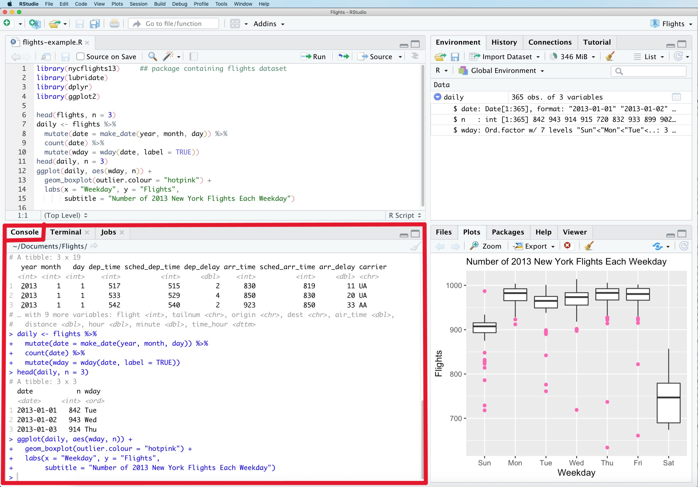
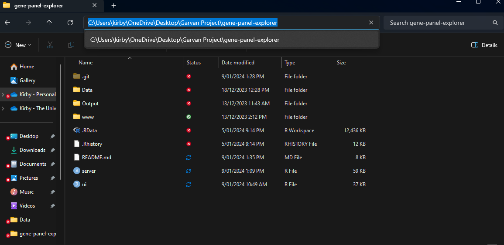
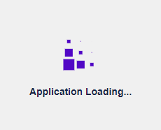

# Gene Panel Explorer

### Background
Whole genome sequencing (WGS) emerged as a clinically useful tool for investigating the underlying genetic causes of various diseases in patients.
Genomic analyses often benefits from the use of gene panels - 
i.e. lists of genes known to be disease-associated, prioritising the search for disease-causing genetic variants. 
Genomic variants may include single nucleotide variations (SNV), insertion-deletions (indels), 
or large structural variations such as chromosomal rearrangments or large deletions. 
However, the design of gene panels may be limited to capturing only a minor fraction of disease-causing variants. 
The design and curation level of gene panels gradually improves over time, as clinical observations are accumulated, 
verified by genetic pathologists, mechanisms are studied by lab investigators, 
and information is published in journals and databases. 
However, for some diseases the diagnostic yield remains low 
(e.g. dystonia studies presently report a 12% identification rate), 
and there is an unmet need to expand the search panels to include additional highly suspected genes.

## Main Project Aims
1. Develop software for expanding panels of disease-associated genes using several strategies:
    - Aggregate existing curated gene panels (PanelApp, DisGeneNet, HPO)
    - Known protein-protein interaction partners (STRING)
    - Co-expression of genes across tissues (GTEx)
    - Analysing gene-phenotype associations (HPO)
2. Add functions for interactively exploring candidate genes, building extended gene panels, outputting reports.
    - Integration of strategies to guide the design of an improved gene panel
3. Develop a process for prioritising important gene candidates.
4. Method for integrating RNA-seq expression observations.

## Public Resources
* Genotype-Tissue Expression Project (GTEx)
    - https://gtexportal.org/home/
* The Human Phenotype Ontology
    - https://hpo.jax.org/app/
* DisGeneNet
    - https://www.disgenet.org/
* PanelApp Australia
    - https://panelapp.agha.umccr.org/
* Genomics England PanelApp
    - https://panelapp.genomicsengland.co.uk/
* Commercial genetic diagnostic tests
    - Invitae Dystonia (38 + 3 add-on genes): https://www.invitae.com/en/providers/test-catalog/test-03351
    - Invitae Parkinson Disease (26 + 3 add-on genes): https://www.invitae.com/en/providers/test-catalog/test-03352
    - Invitae Early-Onset Alzheimer's Disease (3 genes): https://www.invitae.com/en/providers/test-catalog/test-03504
    - Invitae Motor Neuropathy (27 + 3 add-on genes): https://www.invitae.com/en/providers/test-catalog/test-03240
    - Blueprint Genetics (Dystonia, Dementia, Parkinson Disease, Autism Spectrum Disorders): https://blueprintgenetics.com/tests/panels/neurology/
* ClinVar
    - https://www.ncbi.nlm.nih.gov/clinvar/
* The Polygenic Score (PGS) Catalog
    - https://www.pgscatalog.org/


## Contributions
Dystonia studies (WGS and RNAseq), in collaboration with Dr Kishore Kumar and Dr Avi Fellner.
Summer Scholarship Project (27/11/2023 - Feb/2024) - Kirby Smith. 
Discussions with Clinicians : Kishore Kumar, Laura Rudaks, Dennis Yeow, Avi Fellner.

## Installation (Note: under development)

Install R and RStudio (you can follow this guide https://rstudio-education.github.io/hopr/starting.html).

Open RStudio (interface pictured below).



Enter the following commands in the console (highlighted section in the image above) to install all the packages required for the application to run. This will take some time.
Source the installation.R script to run through required package installations and to download reference files (STRING, GO, etc) to the Data folder.

## Running the Application

Set the working directory to "./gene-panel-explorer" by entering the following command in the console. Note that the "./" will differ depending on where you've saved the "gene-panel-explorer" folder. For example, I've saved mine to my desktop in a folder named "Garvan Project" and so in my case the full directory is "C:/Users/kirby/OneDrive/Desktop/Garvan Project/gene-panel-explorer" (pictured below).

```
setwd("./gene-panel-explorer")
```



Load the shiny package and run the application by entering the following commands in the console.

```
library(shiny)
runApp()
```

The application will begin loading in a popup (loading screen pictured below). This will take some time.



After it finishes loading you'll be able to begin using it!

## Usage

### Panel Input

Enter some genes as input:
- Select a disease/phenotype => select a panel => the selected panel's genes are added as input.
    - You can select multiple diseases/phenotypes/panels at the same time. The union of the selected panels' genes will be added as input.
- Enter genes (space-separated) in the "Custom Input" textbox. "Custom Input" acts like another panel - the union of the custom input and selected panels will be taken.
- The total current input is displayed in a preview text box in the bottom left of the screen.

Filter your input:
- Select "Show/Hide Filters" to display the filtering options
    - OMIM genes only
    - Exclude genes
    - Evidence level
    - Panel date
    
Creating/editing/deleting a panel:
- Changes are saved across current and future sessions.

### View Input

This tab allows the user to view the input genes and associated information in a table and plots. Upset plots / Venn diagrams allow the user to visualize the overlap between selected preset panels. A bar plot displays the distribution of the number of genes versus the number of selected input lists each gene belongs to.

### STRING

"Compute Results" => compares the input genes against a database of protein-protein interaction scores, and identifies matching genes that have a protein-protein interaction score above an inputted threshold (you can change the threshold by selecting "Show/Hide Filters").

### GTEx

"Compute Clusters" => divide input genes into k (default k calculated using gap statistic) clusters/subgroups.

"Run Analysis" => choose a cluster and select "Start gene expression analysis" to compute GTEx results for the genes in the selected cluster.

At the bottom of the page, the results for the current cluster are displayed in a text box (space-separated). If you wish to take the top 100 result genes from each cluster, you can append these results to the "Progressive GTEx Results" each iteration.

### Combination

Compute results for STRING. Compute results for GTEx and append them to the GTEx progressive results. This tab combines the STRING results and GTEx progressive results, allowing them to be ranked, with flexible weighting given to either method, and displayed in a table.


### HPO

HPO terms matching the input genes will be displayed. From those terms, users can choose relevant terms and view genes that are most prevalent among the chosen terms.

### GO Annotations

Shows the Gene Ontology Annotations for each of the input genes in a table.

Also displays a plot which shows the 10 most common terms amongst the results.

Able to filter by type of annotation, qualifier, annotation plaintext description.

### Validation

Three methods:
- ClinVar gene-disease associations
  - Input a list of space-separated gene symbols to search for results including those genes.
  - Can also input a specific disease term to filter results to only include that term.
- ClinVar gene variant information
  - Input a list of space-separated gene symbols to search for variants including those genes.
  - Can filter by clinical significance of variant.
- Check gene panels in local data
  -Input a list of space-separated gene symbols. This method will show, for the selected disease(s), how many total panels (under the selected disease(s)) the input genes appear in.


